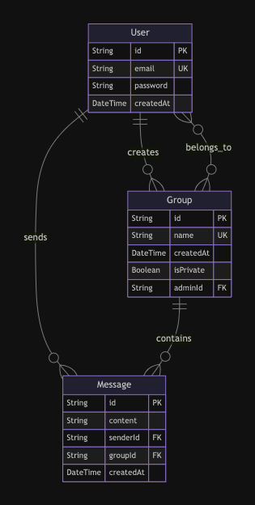

## Running Locally

> [!NOTE]  
> This project uses [pnpm](https://pnpm.io/) only as a package manager.

1. Clone the repository:

```bash
git clone https://github.com/iAryanK/chat-app-backend.git
```

2. Navigate to the project directory:

```bash
cd ./chat-app-backend
```

3. Create a .env.development file & Copy the below environment variables to `.env.development`.

```bash
PORT = 3000
NODE_ENV = "development"
JWT_SECRET="TopSecret"
```

4. Install dependencies:

```bash
pnpm install
```

5. Start the development server:

```bash
pnpm dev
```

6. Access the application in your browser:

```bash
http://localhost:3000
```

## API Documentation

- Swagger API Documentation is available at `/api-docs` route.

```bash
http://localhost:3000/api-docs
```

## ER Diagram



